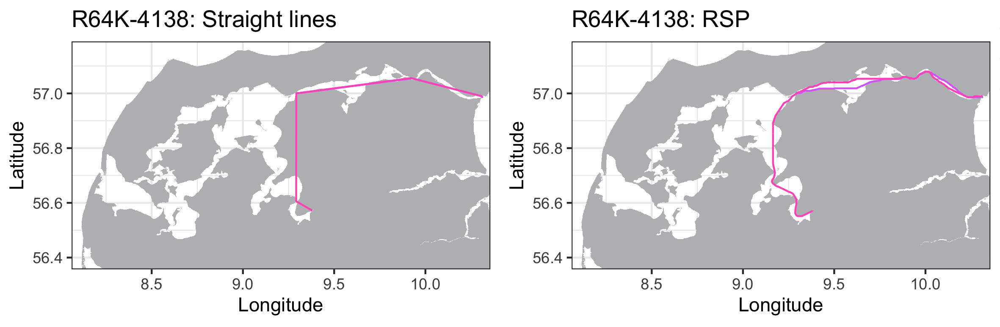

# RSP

Refining the Shortest Paths (RSP) of animals tracked with acoustic
transmitters in estuarine regions

## Overview

The RSP toolkit is a method for analyzing the fine scale movements of
aquatic animals tracked with passive acoustic telemetry in estuarine
environments, that accounts for the surrounding land masses. The animal
movements between detections are recreated to have occurred exclusively
in water and the utilization distribution areas are limited by the land
contours, providing realistic estimations of space use. The method can
be divided into two main steps:

1)  Estimating the shortest in water paths between acoustic detections
2)  Calculating utilization distribution areas using dynamic Brownian
    Bridge Movement Models

Depending on the research questions being addressed the utilization
distribution areas can be calculated for the entire monitoring periods,
or in fine-scale according to fixed temporal intervals in hours
(timeframes). Tracked animals are assigned to specific biological groups
(different species, different sexes from a same species, etc.) prior to
analysis, and the RSP calculates the ammounts of inter-group overlap in
space and time between all groups monitored. This approach allows
spatial ecologists to use the outputs from such fine scale space use
models (areas of use, or between-group overlap frequencies) as input for
further statistical analysis.

Here is an example of the same animal movements animated both using
**only the receiver locations** and the **receiver and RSP positions
combined**:


## Main RSP functions

### Running the analysis

**runRSP()**

You can use runRSP() to estimate the shortest in water paths. Each
animal monitored is analysed individually and all detections are
assigned to separate **tracks**: a sequence of detections with
**intervals shorter than 24 hours**. When the animal is not detected for
a period of time **longer than a day** a **new track** is created.

**dynBBMM()**

After the shortest in water paths are estimated the **runRSP() output**
can be used for calculating utilization distribution areas using
**dynamic Brownian Bridge Movement Models** (dBBMM). This same function
can be either used for assessing the overall space use of tracked
animals or in fine scale (by setting the **timeframe** argument in
hours). While the former calculates the dBBMM at **track level**, which
can vary from a couple of hours to several days long, the latter does so
according to **fixed temporal windows** over the entire monitoring
period.

### Plotting the results

**plotRSP()**

Can be used to visualize the **runRSP() output** to inspect for
differences in tracks using either only receiver locations (Straight
lines) and the RSP:



**plotContours()**

Plots a specified dBBMM utilization distribution:


**plotOverlap()**

To investigate where in the study area the overlaps between **different
biological groups** occurred:


## Installation

Current version: **0.1.0**

You will need the **devtools** package **to install RSP**:

``` 
install.packages("devtools")
library("devtools")     
```

Now you can install RSP using:

    install_github("YuriNiella/RSP")

All the information you need on how to perform the RSP analysis can be
found in the package vignettes:

    browseVignettes("RSP")
