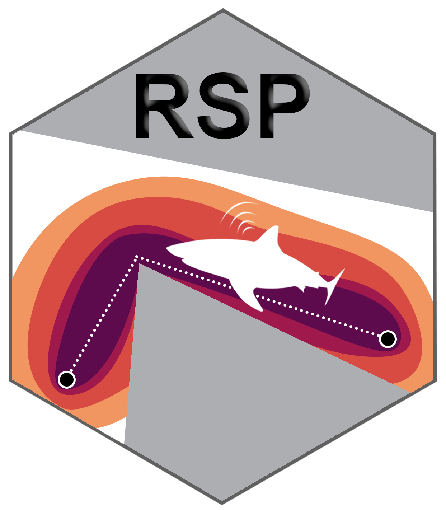
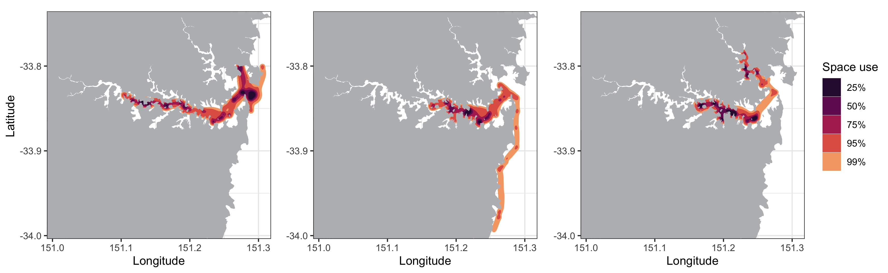
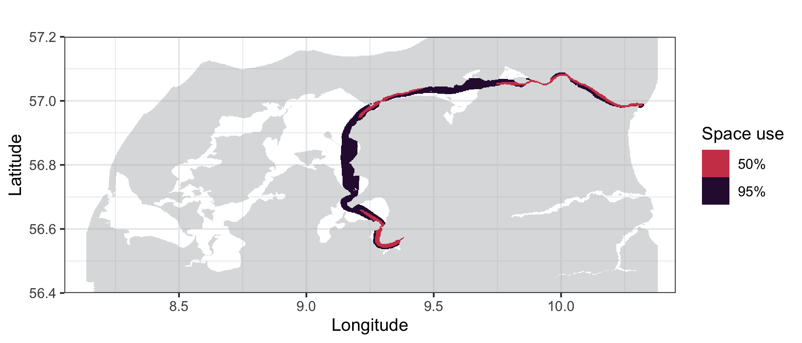
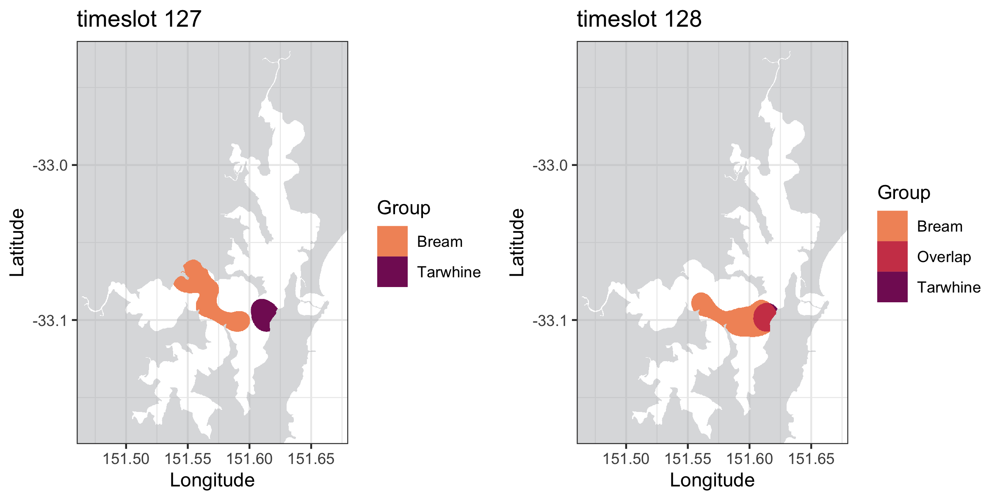
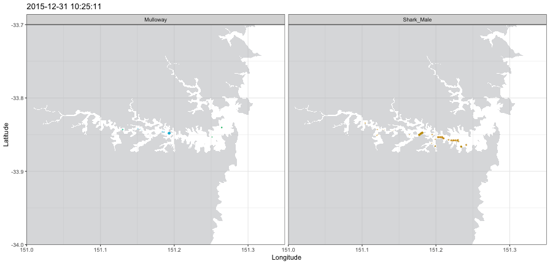

# RSP

[](https://github.com/YuriNiella/RSP/actions)
[](https://travis-ci.com/github/YuriNiella/RSP)
[](https://codecov.io/github/YuriNiella/RSP)
[](https://zenodo.org/badge/latestdoi/200786116)


Refining the Shortest Paths (RSP) of animals tracked with acoustic
transmitters in estuarine regions

## Overview

The RSP toolkit is a method for analyzing the fine scale movements of
aquatic animals tracked with passive acoustic telemetry in estuarine
environments, that accounts for the surrounding land masses. The animal
movements between detections are recreated to have occurred exclusively
in water and the utilization distribution areas are limited by the land
contours, providing realistic estimations of space use. The method can
be divided into the following three main steps:

1)  Refining the shortest paths in water between consecutive acoustic detections
2)  Calculating utilization distribution areas using dynamic Brownian
    Bridge Movement Models (dBBMM)
3)	Calculating the overlaps between different biological groups monitored

Depending on the research questions being addressed, the utilization
distribution areas can be calculated for the entire monitoring periods,
or in fine-scale according to fixed temporal intervals in hours
(timeframes). Tracked animals are assigned to specific biological groups
(different species, different sexes from a same species, etc.) prior to
analysis, and RSP can be used for calculating the amounts of inter-group overlap in
space and time between all groups monitored. This approach allows
spatial ecologists to use the outputs from such fine-scale space use
models (areas of use, or the between-group overlaps) as input for
further statistical analysis.

Here is an example of the same animal movements animated both using
**only the receiver locations** and the **receiver and RSP positions
combined**:


## Main RSP functions

### Running the analysis

**runRSP()**

Used to estimate the shortest in-water paths. Each
animal monitored is analysed individually and all detections are
assigned to separate **tracks**: a sequence of detections with
intervals shorter than 24 hours (by default, max.time = 24). When the animal is not detected for
a period of time longer than the maximum.time argument, a new track is created.

**dynBBMM()**

After the shortest in-water paths are estimated, the utilization distribution areas can be calculated with
**dynamic Brownian Bridge Movement Models** (dBBMM). Models can be either calculated for the entire monitoring, or during a particular interval of interest. 

**getDistances()**

Calculates the distances travelled (in meters) during each RSP track, both using only the receiver locations and also the exclusively in-water tracks. 

**getAreas()**

Obtains the in-water areas (in squared meters) for the tracked animals, either at monitored group or track levels. The contour levels of interest from the dBBMMs can be set, and by default areas are calculated for the **50%** and **95%** contours.

**getOverlaps()**

Calculates the amounts of overlap among different biological groups monitored, at the same contour levels as defined in getAreas(). Overlaps are returned as **only in space** for group dBBMM, and if a timeframe is set (in hours), overlaps are **simultaneously in space and time** for timeslot dBBMM.  


### Plotting the results

**plotTracks()**

This function can be used to visualize the tracks created using **runRSP()**:


**plotContours()**

Plots the dBBMM utilization distribution areas calculated for each animal using **dynBBMM()**:


 
**plotAreas()**

This plot shows the space use areas from a particular group of animals:



**plotOverlap()**

This function shows where in the study area the overlaps between **different
biological groups** occurred:




**animateTracks()**

This function can be used to create an **animation** of the **RSP tracks**:



## Installation

Current version: **1.0.2**

You will need the **remotes** package **to install RSP**:

``` 
install.packages("remotes")
library("remotes")     
```

Now you can install RSP using:

    remotes::install_github("YuriNiella/RSP", build_opts = c("--no-resave-data", "--no-manual"), build_vignettes = TRUE)

All the information you need on how to perform the RSP analysis can be
found in the package vignettes:

    browseVignettes("RSP")
