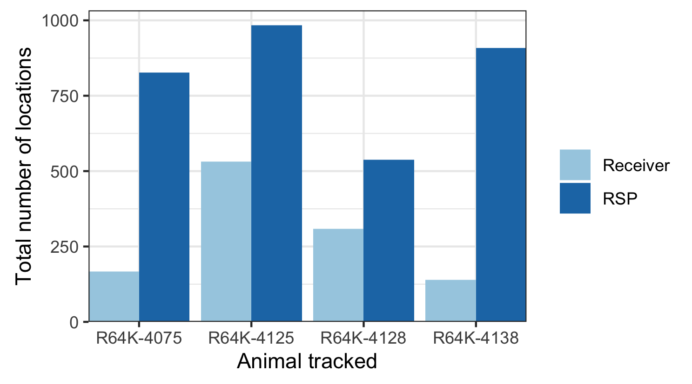
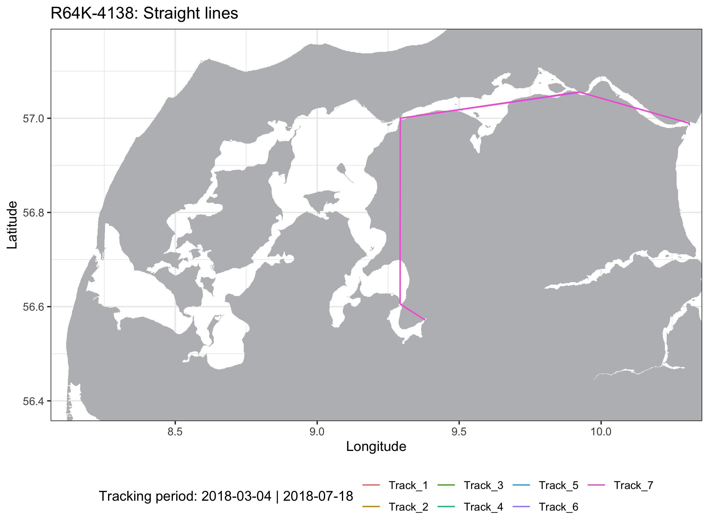
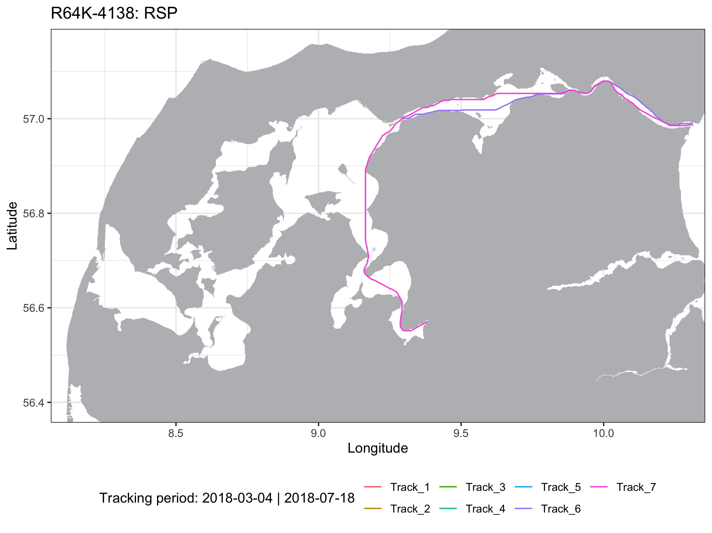

```{r setup, include = FALSE}
knitr::opts_chunk$set(
	echo = TRUE)
```

## 1. Overview

The Refining the Shortest Paths (RSP) toolkit is a method for analyzing the fine-scale movements of aquatic animals tracked with passive acoustic telemetry in estuarine environments, that accounts for the surrounding land masses. The animal movements between detections are recreated to have occurred exclusively in water and the utilization distribution areas are limited by the land contours, providing realistic estimations of space use. The method can be divided into two main steps:

(1) Estimating the shortest in water paths between acoustic detections
(2) Calculating utilization distribution areas using dynamic Brownian Bridge Movement Models

Depending on the research questions being addressed the utilization distribution areas can be calculated for the entire monitoring periods, or in fine-scale according to fixed temporal intervals (in hours). Tracked animals are assigned to specific biological groups (different species, different sexes from a same species, etc.) prior to analysis, and the RSP calculates the ammounts of inter-group overlap in space and time between all groups monitored. This approach allows spatial ecologists to use the outputs from such fine-scale space use models (areas of use, or between-group overlap frequencies) as input for further statistical analysis.

The RSP package can be downloaded using the following comand line:
```
install.packages("devtools")
library("devtools")
install_github("YuriNiella/RSP")
```

<font style="red"> I think this first section might belong better in the README. Not sure if we had discussed this before! </font>

## 2. Preparing the data 

### 2.1. Preliminary analysis using actel

Analysing acoustic telemetry data requires initial filtering to exclude misleading data (e.g. false detections, detections prior to release). To overcome this issue and ensure reliable results, the RSP toolkit operates in close relationship with the **actel R package**, which is filters and invalidates flawed detections. Before getting started with RSP, you will have to download actel and filter your acoustic data. Please click [here](https://github.com/hugomflavio/actel) for more information and to download actel.

To start using RSP, you can run the simplest actel analysis with the function `explore`. You can find more about how organize your data and run this preliminary analysis in actel's manual pages (run ?actel after loading the library).

It is important that you save the output of the actel function, so you can later on use it to calculate the RSP. e.g.:

```
library(actel)
filtered_data <- explore(tz = "Europe/Sydney")
```

### 2.2. Creating and exporting a raster file from the study area in QGIS

After filtering your acoustic data, you will need a **raster file** from your study area defining the water and land limits. This file will be used for estimating the shortest paths in water between consecutive acoustic detections, using a least-cost analysis of constrained random walks. The values of the raster cells must comprise zeros (water) or ones (land). Depending on the size of your study area, a resolution of 0.0001 (latitude ° x longitude °) is suggested for more accurate estimations (especially for sites with very narrow channels). Please see the following steps for generating and exporting a raster file from you study site in the [QGIS](https://qgis.org/en/site/forusers/download.html) software: 

(1) Load a good-resolution shapefile of your study region into QGIS:

{#id .class width=680}

(2) Zoom into your study site and create an overlapping polygon that encompasses the entire area,

{#id .class width=680}

(3) Clip your study site from the shapefile using "Vector > Geoprocessing Tools > Clip" setting the shapefile as the input layer and the overlap polygon as the overlay layer:

{#id .class width=680}

(4) Create a raster layer from the Clipped shapefile using the "Rasterize" tool from the toolbox setting the Output Values to "data / no-data" and Cellsize to 0.0001 for a better resolution:

{#id .class width=680}

(5) Right-click on the raster layer and select "Export > Save As...". In the new window select the "Golden Software Binary Grid (.grd)" from the dropdown format menu. In the extent menu, select the "Calculate from Layer" option and then click on the "Clipped" layer:

{#id .class width=680} {#id .class width=680}

(6) You can now import the raster from your study area into R and plot it to check whether the resolution (Cellsize) chosen is good enough:
```
library(raster)
LakeMacquarie <- raster("Lake_Macquarie.grd") # Import the raster file exported from QGIS
plot(LakeMacquarie) # Plot raster from the study area
```

{#id .class width=60% height=60%}

Now that your acoustic detections have been filtered and that you have a raster file with good resolution from your study area (exported into your working directory), you are all set to get started with RSP. 


## 3. Estimation of shortest in-water paths

The ```runRSP()``` function is used to recreate the shortest paths between pairs of acoustic detections. The detection data, station coordinates and the group of each fish is passed on to RSP automatically by actel through the argument `input`. You must also include the name of the .grid file you created above in the argument `base.raster`. e.g.:

```
library(RSP)
rsp.results <- runRSP(input = filtered_data, base.raster = "Lake_Macquarie.grd")
```

A transition layer object is calculated using the **raster file** to estimate these paths exclusively in the water. The raster is automatically imported during the analysis through the argument ```base.raster = "name_of_your_file.grd"```. Because this step can take some time depending on the size of your study area and the size of the raster cells, the transition layer will be saved for future re-analysis in case the detection data changes. When running the analysis again the following message is shown:

```
M: Reusing transition layer calculated on 2019-11-30 13:48:19.
   If you want to calculate a new transition layer, run rmTransition() before re-starting the analysis.
```

The detection ranges of each listening station are also taken into account in the ```runRSP()```. These will be used as the location errors for the dBBMM when calculating UD areas. A 'Range' column can be included in the **spatial.csv file** for specifying the detection ranges (in meters) for each acoustic station if these are known. If the 'Range' column is not found, a default detection range of 500 m is automatically considered for each receiver with the warning:

```
Warning: Could not find a 'Range' column in the spatial data; assuming a range of 500 metres for each receiver.
```

Note:
	- The 'Range' column must already be present in the spatial.csv file when you run the `explore()` function for it to be incorporated in the analysis.

While animals move between a pair of consecutive acoustic detections there is some uncertainty regarding the trajectory taken, which increases proportionally to the time taken to from one place to another. Consecutive detections longer than 24 hours apart are thus broken by the ```runRSP()``` into separate 'tracks'. This avoids the estimation of unrealistic behaviour when the animals do not get detected in any array for exceedingly long periods of time. Detections that occur totally isolated (e.g. **more than 24-h** before or after any other detection) are automatically excluded from analysis. The ```runRSP()``` will return the percentage of raw detections that can be used for refining the shortest paths when the analysis is finished:
```
M: Percentage of detections valid for RSP: 99.8%
```

Pairs of detections can occur either at the same receiver or at different receivers. For consecutive detections on different receivers, estimated positions are added according to a fixed ```distance``` argument in meters (250 m by default). On the other hand, if a fish is detected consecutively at the same station (with a time interval greater than the stipulated at the ```time.lapse``` argument), then estimated positions are added at that receiver location, over intervals of approximately [`time.lapse`] minutes. E.g. if a fish is detected at a station twice with a 22 minute interval, and `time.lapse` is set to 10, two estimated detections will be included.

While moving away from the first detection, the **position errors** gradually increase for each estimated position at a 5% rate of the ```distance```. When the animal reaches half of the elapsed time/distance between the first and the second detection, the errors of estimated positions now gradually decrease as it approaches the second receiver where it got detected. This principle is used for both pairs of detections on different receivers, and for consecutive detections at the same station when the time difference is longer than ```time.lapse```.

{#id .class width=70% height=70%}


{#id .class width=85% height=85%}

<!-- <font color="red">maybe a graphical representation of the estimated position inclusion would be nice (because the distance between estimated positions will rarely exactly match the distance or time.lapse argument). (OK) </font>
 -->

The dynamic Brownian Bridge Movement Model accounts for the speed at which animals move between consecutive detections to expand/contract the UD areas. Consequently, depending on your array configuration, estuary shape and species being tracked, you might find necessary to adjust the ```distance``` and ```time.lapse``` arguments to recreate the most plausible movement patterns of the monitored animals. 

<!-- <font color="red">I think we should shortly explain here that the Brownian bridge model tools will account for the speed at which the fish moved between detections to expand/contract the location errors as well. </font>
 -->

### 3.1. Exploring the RSP results

Here are some examples of the ```runRSP()``` output:

(1) For consecutive detections on the same receiver:

|           Timestamp| Receiver| Transmitter| Error| Longitude| Latitude| Position|   Track|
|:-------------------|--------:|-----------:|-----:|---------:|--------:|--------:|-------:|
| 2018-03-07 00:43:49|   125449|   R64K-4075|   500|  9.380188|  56.5716| Receiver| Track_3|
| 2018-03-07 00:53:07|       NA|   R64K-4075| 512.5|  9.380188|  56.5716|      RSP| Track_3|
| 2018-03-07 01:02:26|       NA|   R64K-4075| 512.5|  9.380188|  56.5716|      RSP| Track_3|
| 2018-03-07 01:11:45|   125449|   R64K-4075|   550|  9.380188|  56.5716| Receiver| Track_3|

The **Position** column in this dataset identifies the two consecutive acoustic detections (```Receiver```) from this animal. We can notice that they occurred on the same **Receiver** (```125449```): the first on ```2018-03-07 00:43:49``` and the second on ```2018-03-07 01:11:45``` (approximately 30 minutes from each other). Because this time difference is longer than the default ```time.lapse``` (10 minutes), the ```runRSP()``` estimated the intermediate positions (```RSP```) by repeating the receiver **Longitude** and **Latitude** and changing the **Error** parameter (at a rate of 5% from the default ```distance``` argument of 250 meters = 12.5 meters). 


(2) Consecutive detections on different receivers:

|           Timestamp| Receiver| Transmitter| Error| Longitude| Latitude| Position|   Track|
|:-------------------|--------:|-----------:|-----:|---------:|--------:|--------:|-------:|
| 2018-04-27 05:27:10|   100474|   R64K-4125|   500|  9.921725| 57.05595| Receiver| Track_5|
| 2018-04-27 05:35:17|       NA|   R64K-4125| 512.5|  9.928500| 57.05450|      RSP| Track_5|
| 2018-04-27 05:43:24|       NA|   R64K-4125|   525|  9.935500| 57.05350|      RSP| Track_5|
| 2018-04-27 05:51:32|       NA|   R64K-4125| 537.5|  9.943500| 57.05450|      RSP| Track_5|
| 2018-04-27 05:59:39|       NA|   R64K-4125|   550|  9.949500| 57.05650|      RSP| Track_5|
| 2018-04-27 06:07:47|       NA|   R64K-4125| 562.5|  9.955500| 57.05850|      RSP| Track_5|
| 2018-04-27 06:15:54|       NA|   R64K-4125|   575|  9.960500| 57.06150|      RSP| Track_5|
| 2018-04-27 06:24:01|       NA|   R64K-4125| 562.5|  9.964500| 57.06550|      RSP| Track_5|
| 2018-04-27 06:32:09|       NA|   R64K-4125|   550|  9.968500| 57.06850|      RSP| Track_5|
| 2018-04-27 06:40:16|       NA|   R64K-4125| 537.5|  9.975500| 57.07050|      RSP| Track_5|
| 2018-04-27 06:48:24|       NA|   R64K-4125|   525|  9.981500| 57.07250|      RSP| Track_5|
| 2018-04-27 06:56:31|       NA|   R64K-4125| 512.5|  9.986500| 57.07450|      RSP| Track_5|
| 2018-04-27 07:04:39|   107527|   R64K-4125|   500|  9.992500| 57.07650| Receiver| Track_5|

Here the animal was detected first at the **Receiver** ```100474``` on ```2018-04-27 05:27:10```, and then at the **Receiver** ```107527``` on ```2018-04-27 07:04:39```. The ```runRSP()``` now calculated the shortest in-water path between receivers, and we can see how the **Error** of added locations increased up to half-way, (575 meters on ```2018-04-27 06:15:54```), and then decreased back to 500 as the track approached the second receiver.


### 3.2. Visualizing RSP outputs

We can use ```plotDistances()``` to compare the total distances travelled by each animal calculated using only the receiver locations and or also including the RSP estimations:

<center>
{#id .class width=70% height=70%} 
</center>

The ```plotDetections()``` shows the total number of receiver and estimated positions for each tracked animal:

<center>
{#id .class width=70% height=70%} 
</center>

You can also plot all tracks from a particular animal using ```plotRSP()```:

```
# Plot tracks only with receiver locations:
plotRSP(input = rsp.results, tag = "R64K-4075", display = "Receiver", type = "lines") 
```

<center>
{#id .class width=80% height=80%} 
</center>

```
# Plot tracks with RSP estimations:
plotRSP(input = rsp.results, tag = "R64K-4075", display = "RSP", type = "lines")
```

<center>
{#id .class width=80% height=80%} 
</center>

You can also set ```display = "Both"``` to plot both track options on a single plot. 


## 4. Calculating utilization distribution areas and space-use overlaps

After estimating the in-water shortest paths, we can now use the output from ```runRSP()``` to calculate UD areas with the ```dynBBMM()``` function. Here you will need to know the [UTM zone](http://www.dmap.co.uk/utmworld.htm) of your study site and specify it using the argument ```UTM.zone```. By default, the analysis will run for all transmitters detected, but you can determine also which transmitters you would like to include using ```tags```. As mentioned before, UD areas can be calculated with either of the following temporal resolutions:

### 4.1. Total dynamic Brownian Bridge Movement Model (group dBBMM)

This option calculates a series of dBBMM for each animal track from all the groups monitored. The ```breaks``` argument defines for which contours the areas of use should be calculated, which by default are the 50% and 95% (i.e. `breaks = c(.5, .95)`). 

Track **quality checks** are performed to ensure that only good tracks which allow the dBBMM to converge are included in the analysis. This is an example of the returned messages from ```dynBBMM()```:

```
> group.dbbmm.results <- dynBBMM(input = rsp.results, UTM.zone = 56, breaks = c(0.5, 0.95))

M: Preparing data to apply dBBMM.
M: No specific transmitters selected. All the data will be used for analysis.
Warning: 8 track(s) in group Bream have less than eight detections and will not be used.
Warning: 5 track(s) in group Luderick have less than eight detections and will not be used.
Warning: 1 individual detections were removed in group Tarwhine due to simultaneous detections at two receivers.
Warning: 2 track(s) in group Tarwhine have less than eight detections and will not be used.
M: In total, 57 detections were excluded as they failed the track quality checks.
```

After calculating UDs, the **land areas** are excluded so that the final results represent only **in-water areas of use**. The overall overlap between each group monitored is also calculated. 

```
M: Subtracting land areas from output.
M: Calculating overlaps between groups.
M: Storing final results.
```

The results of the dBBMM are saved in the ```$track.areas``` object, as a list of data frames for each group analysed:

|             Track|               Start|                Stop| Area.5| Area.95| Time.lapse.min|
|:-----------------|-------------------:|-------------------:|------:|-------:|--------------:|
| R64K-4075_Track_3| 2018-03-07 00:41:10| 2018-03-07 08:20:02|     20|      49|         458.87|
| R64K-4075_Track_7| 2018-04-24 11:40:56| 2018-04-26 01:00:13|	 5817|	 17245|        2239.28|
| R64K-4075_Track_8| 2018-08-20 11:56:47| 2018-08-23 19:21:20|  10609|	 36115|	       4764.55|
| R64K-4125_Track_2| 2018-04-21 13:13:24| 2018-04-22 08:45:30|     73|     322|        1172.10|
| R64K-4125_Track_3| 2018-04-25 11:44:05| 2018-04-28 14:10:14|   1469|   16504|        4466.15|
| R64K-4125_Track_4| 2018-08-23 12:16:57| 2018-08-25 15:08:31|   5875|   15937|        3051.57|
| R64K-4125_Track_5| 2018-08-27 08:44:04| 2018-08-28 16:29:47|     51|     175|        1905.72|
| R64K-4125_Track_6| 2018-08-30 17:26:41| 2018-08-31 15:43:46|     80|     418|        1337.08|
| R64K-4128_Track_1| 2018-04-13 09:44:22| 2018-04-13 10:15:42|     50|     168|          31.33|
| R64K-4128_Track_3| 2018-04-28 16:29:07| 2018-04-29 15:25:16|   2132|    4793|        1376.15|
| R64K-4128_Track_4| 2018-07-03 05:29:38| 2018-07-05 13:29:06|   3954|   16292|        3359.47|
| R64K-4128_Track_5| 2018-07-08 05:01:36| 2018-07-08 22:43:43|    478|    2002|        1062.12|
| R64K-4138_Track_2| 2018-03-07 23:39:11| 2018-03-08 00:57:45|     21|      53|          78.57|
| R64K-4138_Track_6| 2018-04-18 10:49:47| 2018-04-20 12:38:33|   4404|   16396|        2988.77|
| R64K-4138_Track_7| 2018-07-14 22:10:35| 2018-07-18 18:33:43|   7110|   36902|        5543.13|

Each `Track` is named after the transmitter and the corresponding track name and both `Start` and `Stop` timestamps are stored. **Areas of use** (by default `Area.5` and `Area.95`) are saved in squared meters, together with the respective elapsed times in minutes (`Time.lapse.min`). Note that in this example for the animal **R64K-4075 only the Track_3, Track_7 and Track_8** were used for calculating space use areas, as the remainder ones failed the quality checks. 

You can use ```plotContours()``` to visualize any of the dBBMM calculated by specifying the ```group``` and ```track``` you want to plot:

```
plotContours(input = group.dbbmm.results, group = "R64K-4138", track = 'R64K-4138_Track_7', main = "R64K-4138_Track_7")
```

{#id .class width=75% height=75%} 

```
plotContours(input = group.dbbmm.results, group = "Bream", track = 'A69-9002-10473_Track_08', main = "A69-9002-10473_Track_08", stations = TRUE)
```

{#id .class width=75% height=75%} 


### 4.2. Total space-use overlap 

Now that we calculated the areas of space-use within our study area for each group monitored, we can investigate the ammount of overall overlap between them stored in the ```$overlap.areas``` object:

```
group.dbbmm.results$overlap.areas$`0.5`
group.dbbmm.results$overlap.areas$`0.5`$absolute
```
|          | R64K-4075| R64K-4125| R64K-4128| R64K-4128|
|:---------|---------:|---------:|---------:|---------:|
| R64K-4075|        NA|      7274|      5456|     11145|
| R64K-4125|   	  7274|        NA|      4378|      5624|
| R64K-4128|	  5456|      4378|        NA|	   4128|
| R64K-4138|     11145|      5624|      4128|        NA|
```
group.dbbmm.results$overlap.areas$`0.5`$percentage
```
|          | R64K-4075| R64K-4125| R64K-4128| R64K-4128|
|:---------|---------:|---------:|---------:|---------:|
| R64K-4075|        NA|    0.9292|    0.8468|    0.8426|
| R64K-4125|    0.9292|        NA|    0.6794|    0.7184|
| R64K-4128|	0.8468|    0.6794|        NA|	 0.6406|
| R64K-4138|    0.8426|    0.7184|    0.6406|        NA|
```
group.dbbmm.results$overlap.areas$`0.95`
group.dbbmm.results$overlap.areas$`0.95`$absolute
```
|          | R64K-4075| R64K-4125| R64K-4128| R64K-4128|
|:---------|---------:|---------:|---------:|---------:|
| R64K-4075|        NA|     36853|     16567|     39758|
| R64K-4125|     36853|        NA|     16592|     36599|
| R64K-4128|	 16567|     16592|        NA|	  18192|
| R64K-4138|     39758|     36599|     18192|        NA|
```
group.dbbmm.results$overlap.areas$`0.95`$percentage
```
|          | R64K-4075| R64K-4125| R64K-4128| R64K-4128|
|:---------|---------:|---------:|---------:|---------:|
| R64K-4075|        NA|    0.9425|    0.8986|    0.9728|
| R64K-4125|    0.9425|        NA|    0.8999|    0.9360|
| R64K-4128|	0.8986|    0.8999|        NA|	 0.9867|
| R64K-4138|    0.9728|    0.9360|    0.9867|        NA|


Please note the overlaps are calculated for the contours defined by ```breaks``` in ```dynBBMM()```, and returned both in ```$absolute``` values (**squared meters**) and ```$percentage``` matrices. For example, we can see in the last table that **R64K-4075** and **R64K-4125** were the groups with higher overall overlap of 92.92% at the 95% level, whereas **R64K-4075** and **R64K-4128** had a smaller overlap of 89.86% at the 95% contour. To see exactly where space use overlaps occurred you can use ```plotOverlap()```:

(REVIEW STOPPED HERE)

```
plotOverlap(input = group.dbbmm.results, stations = FALSE, level = .95, store = TRUE)
```

{#id .class width=680} 


### 4.3. Fine-scale dynamic Brownian Bridge Movement Model (timeslot dBBMM)

dBBMMs can also be calculated according to a moving temporal window. This allows investigating how the space-use overlap between the different groups varied during the study period. It is useful for assessing the influence of environmental parameters upon space-use of different groups tracked within the study area. The same ```dynBBMM()``` function is used, but here the argument ```timeframe``` has to be defined in hours as the temporal window. The total tracking period will be divided into `timeslots`, and dBBMMs calculated for each group monitored (for each timeslot). Overlapping areas are now calculated for each ```timeslot``` and the corresponding metadata stored in the ```$timeslots``` object:

```
time.dbbmm.results <- dynBBMM(input = rsp.results, UTM.zone = 56, breaks = c(0.5, 0.95), timeframe = 12) # 12-h timeslots
head(time.dbbmm.results$timeslots)
```
| slot|               start|                stop| Bream| Luderick| Tarwhine|
|:----|-------------------:|-------------------:|-----:|--------:|--------:|
|    1| 2013-09-02 00:00:00| 2013-09-02 12:00:00| FALSE|    FALSE|    FALSE|
|    2| 2013-09-02 12:00:00| 2013-09-03 00:00:00| FALSE|     TRUE|    FALSE|
|    3| 2013-09-03 00:00:00| 2013-09-03 12:00:00| FALSE|     TRUE|     TRUE|
|    4| 2013-09-03 12:00:00| 2013-09-04 00:00:00| FALSE|    FALSE|     TRUE|
|    5| 2013-09-04 00:00:00| 2013-09-04 12:00:00|  TRUE|    FALSE|     TRUE|
|    6| 2013-09-04 12:00:00| 2013-09-05 00:00:00|  TRUE|    FALSE|     TRUE|

In the example above we can notice that in the first ```timeslot``` none of the groups were detected, whereas **Luderick** group got detected in **slot 2** and both Luderick and Tarwhine were detected on the first 12-h of 2013-09-03 (**slot 3**). The ```$track.areas``` object for each tracked group will now have a first column named **Slot**, which identifies the ```timeslot``` for each of the dBBMM calculated:

```
head(time.dbbmm.results$track.areas)?
```
<font style="red"> what was the command to get the table below exactly?</font>

| Slot|                  Track|               Start|                Stop| Area.5| Area.95| Time.lapse.min|
|:----|----------------------:|-------------------:|-------------------:|------:|-------:|--------------:|
|  486| A69-9002-10474_Track_1| 2014-05-02 12:11:54| 2014-05-02 23:54:41|    249|     962|       702.7833|
|  486| A69-9002-10480_Track_1| 2014-05-02 12:21:36| 2014-05-02 23:37:18|    279|    1215|       675.7000|
|  487| A69-9002-10474_Track_1| 2014-05-03 00:12:19| 2014-05-03 11:42:37|    238|     897|       690.3000|
|  487| A69-9002-10480_Track_1| 2014-05-03 01:18:26| 2014-05-03 11:56:30|   1170|    4516|       638.0667|
|  488| A69-9002-10474_Track_1| 2014-05-03 12:11:19| 2014-05-03 23:56:57|    274|    1051|       705.6333|
|  488| A69-9002-10480_Track_1| 2014-05-03 12:26:10| 2014-05-03 23:48:24|    345|    1396|       682.2333|

Here we can see that two animals were detected for this particular group between **Slot 486** and **Slot 488**: the transmitters **A69-9002-10474** and **A69-9002-10480**. The **Time.lapse.min** will now be very similar as its maximum elapsed time is limited by the ```timeframe``` argument, and it depends on the times of first and last locations for each animal. 

The following command line can help you assess if any other group got detected during this same ```timeslot```:

```
> time.dbbmm.results$timeslots[486, ]
    slot               start                stop Bream Luderick Tarwhine
486  486 2014-05-02 12:00:00 2014-05-03 00:00:00  TRUE     TRUE    FALSE
```

Yes, both **Bream** and **Luderick** were detected between ```2014-05-02 12:00:00``` and ```2014-05-03 00:00:00```. We can inspect whether the two groups overlapped or not:

```
> time.dbbmm.results$overlap.areas$`0.95`$percentage$`486`
             Bream  Luderick Tarwhine
Bream           NA 0.8247734       NA
Luderick 0.8247734        NA       NA
Tarwhine        NA        NA       NA
```

This shows that the two groups had an overlap of 82.47% at the 95% dBBMM contour during this particular ```timeslot```. We can now see exactly where the overlap occurred by plotting the space-use models using:

```
# plotContours() for plotting the individual dBBMM:

plotContours(input = time.dbbmm.results, track = "A69-9002-10474_Track_1", group = "Bream", timeslot = 486, stations = TRUE, main = "A69-9002-10474 (Bream - slot 486)")

plotContours(input = time.dbbmm.results, track = "A69-9002-10480_Track_1", group = "Bream", timeslot = 486, stations = TRUE, main = "A69-9002-10480 (Bream - slot 486)")

plotContours(input = time.dbbmm.results, track = "A69-9002-10481_Track_1", group = "Luderick", timeslot = 486, stations = TRUE, main = "A69-9002-10481 (Luderick - slot 486)")
```

{#id .class width=680} 


```
# plotOverlap() to investigate the overlap areas:

plotOverlap(input = time.dbbmm.results, store = TRUE, stations = FALSE, timeslot = 486) 
```

{#id .class width=680} 


{#id .class width=55% height=55%} 


