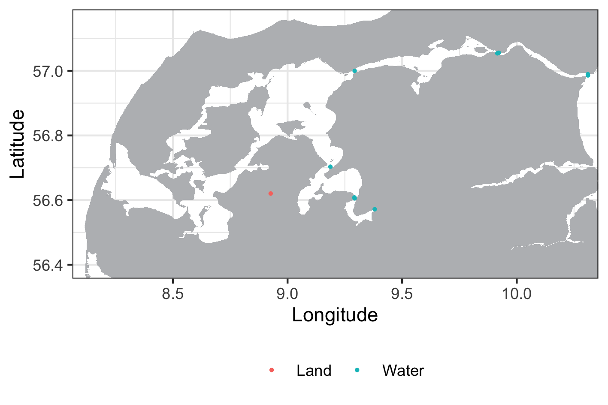

```{r setup, include = FALSE}
knitr::opts_chunk$set(
	echo = TRUE)
```

## Index

1. [Preparing the data](a-1_Preparing_the_data.html)
2. [Refining the Shortest Paths in-water](a-2_Refining_Shortest_paths.html)
3. [Calculating utilization distribution](a-3_dBBMM.html)
4. [Calculating overlaps](a-4_Overlaps.html)
5. [Calculating areas in steps](a-5_Areas_in_steps.html)

***

## Before we start

It is important to clarify the distinction between **receivers** and **stations**. For the purpose of this manual (and RSP in general), a receiver is the actual hydrophone that recorded a detection, while a station is the geographical position where that receiver was placed at the time of recording. Therefore, when referring to tag movements, we will always refer to them as movements **between stations** (because the receivers placed at a station can vary throughout the study period). **Receivers** are referred to by their serial numbers, while **stations** are referred to by their **standard names**. A stations standard name can be found in the spatial data frame (it is essentially the stations row number). We use standard names rather than the names provided by the user to avoid complications during the analysis.

## 1.1. Preliminary analysis of acoustic detections using actel

Analysing acoustic telemetry data requires initial filtering to exclude misleading data (e.g. false detections, detections prior to release). To overcome this issue and ensure reliable results, the RSP tool-kit operates in close relationship with the [**actel R package**](https://cran.r-project.org/package=actel), which filters and invalidates flawed detections. Before getting started with RSP, you will have to download actel and filter your acoustic data.

To start using RSP, you can run the simplest actel analysis with the function `explore`. You can find more about how to organize your data and run this preliminary analysis in actels manual pages (run `browseVignettes('actel')` after loading the library).

It is important that you save the output of the actel function, so you can later on use it in RSP. e.g.:

```
library(actel)
filtered_data <- explore(tz = "Europe/Copenhagen")
```
## 1.2. Using IMOS data in your analyses

{#id .class width=25%}

RSP can be used to process data from the [**IMOS Australian Animal Acoustic Telemetry Database**](https://animaltracking.aodn.org.au/). You will need to download four files from the IMOS database: 

1. Detection data 
2. Receiver deployment metadata
3. Transmitter deployment metadata
4. Animal measurements

Then you can use the `convertIMOS` function to convert these file into the necessary format required for analyses with RSP:

```
# Convert IMOS files:
input.rsp <- convertIMOS( 
 det = "IMOS_detections.csv",
 rmeta = "IMOS_receiver_deployment_metadata.csv",
 tmeta = "IMOS_transmitter_deployment_metadata.csv",
 meas = "IMOS_animal_measurements.csv")
```

While raw detections can be provided to this conversion function, we strongly recomend running a quality-control using the [**remora package**](https://github.com/IMOS-AnimalTracking/remora). To do so, you will need to provide the same files to the `runQC` function, and then select only the **valid** and **likely valid** detections using the `grabQC` function, similar to the following example: 

```
# Specify files to QC (use csv files downloaded from the IMOS database)
files <- list(det = system.file(file.path("test_data","IMOS_detections.csv"),
                    package = "remora"),
              rmeta = system.file(file.path("test_data",
              "IMOS_receiver_deployment_metadata.csv"),
                    package = "remora"),
              tmeta = system.file(file.path("test_data",
              "IMOS_transmitter_deployment_metadata.csv"),
                    package = "remora"),
              meas = system.file(file.path("test_data",
              "IMOS_animal_measurements.csv"),
                    package = "remora"))

# Run quality control in parallel 
qc.out <- runQC(files, .parallel = TRUE)

# Grab only valid and likely valid detections
d.qc <- grabQC(qc.out, what = "dQC", flag = c("valid", "likely valid"))
```

You can then provide the quality-controlled detection file for the conversion function:

```
# Convert IMOS files:
input.rsp <- convertIMOS( 
 det = d.qc, # QC object processed with remora
 rmeta = "IMOS_receiver_deployment_metadata.csv",
 tmeta = "IMOS_transmitter_deployment_metadata.csv",
 meas = "IMOS_animal_measurements.csv")
```

## 1.3. Preparing the data from your study area using actel

To recreate the shortest in-water paths of tracked animals, RSP needs a **transition layer** from your study area. You may already have a transition layer calculated for your study area, or you can use actel again to do so. First, you need to load a **shapefile** (.shp) from your study area **delimiting the land contours** using `loadShape()`. This function automatically imports your shapefile and converts it to a raster, and the corresponding pixel size must be set using the `size` argument (refer to actels documentation for more details). After loading your shapefile, you need to create your transition layer using `transitionLayer()`. You can choose a number of `directions` for distance calculations (again, refer to actels documentation for more details).

```
water.shape <- loadShape(shape = "my_study_area.shp", size = 0.0001)  
water.transition <- transitionLayer(water.shape, directions = 16)
```

Please have in mind that both the transition layer and the base raster (your imported shapefile) will be required during the RSP analysis. RSP currently accepts shapefiles in both **metric** and **geographic** coordinate reference systems.


## 1.4. Checking the quality of the input files

Depending on the shapefile provided from your study area, the pixel size used and the locations of your stations (provided earlier in the spatial dataset for actel), it may be that your stations could end up in land during analysis. This will cause the RSP analysis to return erroneous results, such as animal tracks crossing extensively through land. To avoid this issue, you can use the `plotRaster()` function to test the quality of the input coordinates:


```
plotRaster(input = filtered_data, base.raster = water.shape, coord.x = "Longitude", coord.y = "Latitude")
```

Note:
  : `coord.x` and `coord.y` must be the column names containing the coordinates in the spatial data frame.


{#id .class width=100%}

If you get a plot similar to this one, with only **Water** showing up in the legend, it means that all your stations are placed **in the water** and you are all good to continue. If any stations are **in land**, they will be coloured differently in this plot. If this happens, you must then either adjust your shapefile or the station positions in the spatial dataset before continuing.

Note:
  : Adjusting the station coordinates will require you to run actels analysis again.


[Proceed to Refining the Shortest Paths in-water](a-2_Refining_Shortest_paths.html)

[Back to top.](#)
