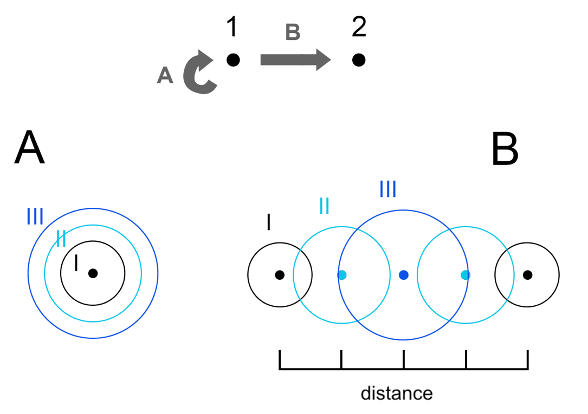
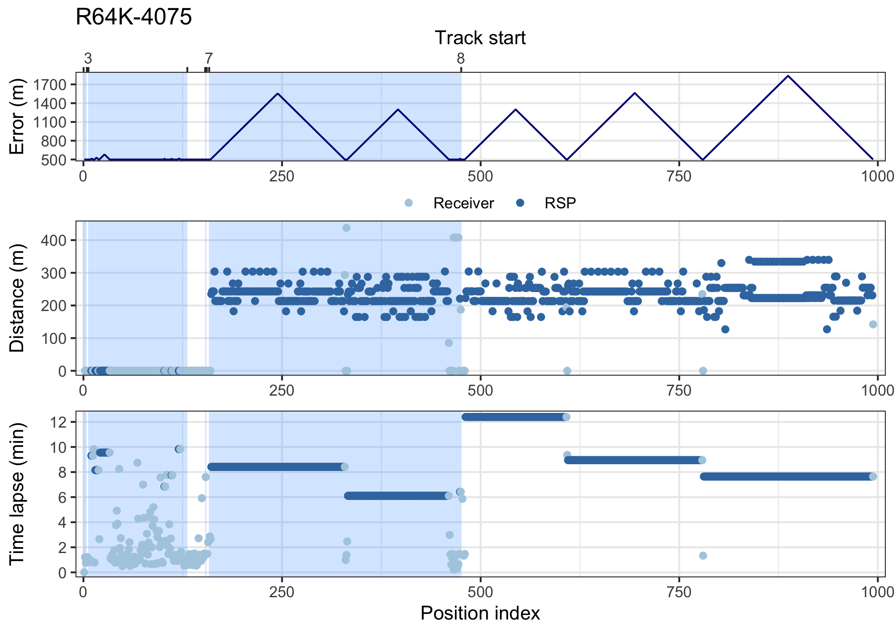
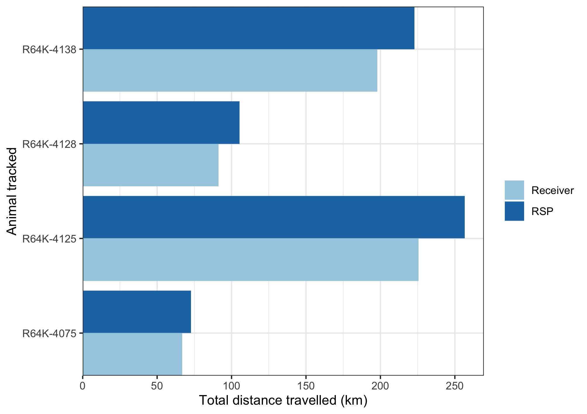
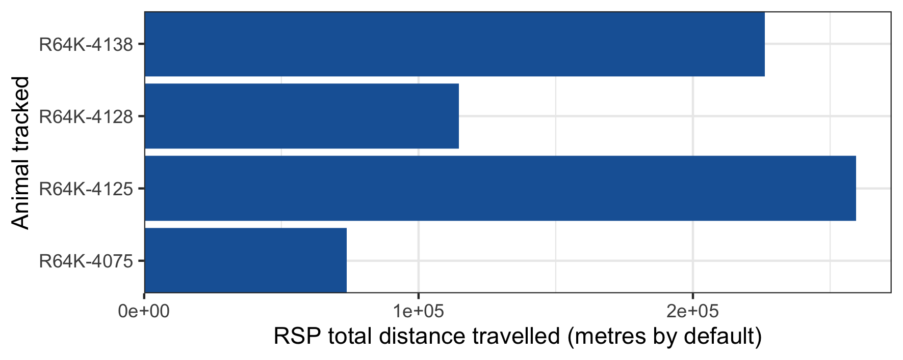

```{r setup, include = FALSE}
knitr::opts_chunk$set(
	echo = TRUE)
```

## Index

1. [Preparing the data](a-1_Preparing_the_data.html)
2. [Refining the Shortest Paths in-water](a-2_Refining_Shortest_paths.html)
3. [Calculating utilization distribution](a-3_dBBMM.html)
4. [Calculating overlaps](a-4_Overlaps.html)

***

The `runRSP()` function is used to recreate the shortest paths between pairs of acoustic detections. By default, the analysis will run for all transmitters detected, but you can determine also which transmitters you would like to include using `tags`. The detection data, station coordinates and the group of each tracked animal is passed on to RSP automatically by actel through the argument `input`. You must also include the name of the transition layer you created using the argument `t.layer`, e.g.:

```
library(actel)
library(RSP)

filtered_data <- explore(tz = "Europe/Copenhagen")

water.shape <- loadShape(shape = "my_study_area.shp", size = 0.0001)  
water.transition <- transitionLayer(water.shape, directions = 16)

rsp.results <- runRSP(input = filtered_data, t.layer = water.transition, coord.x = "Longitude", coord.y = "Latitude")
```

**Note:** 
  * `coord.x` and `coord.y` must be the column names containing the coordinates in the spatial data frame.


The **detection ranges** of each listening station are also taken into account in the `runRSP()`. These will be used as the location errors for the dBBMM when calculating UD areas. A **Range column** can be included in the **spatial.csv file** for specifying the detection ranges (in metres) for each acoustic station if these are known. If the 'Range' column is not found, a default detection range of 500 m is automatically considered for each receiver with the warning:

```
Warning: Could not find a 'Range' column in the spatial data; assuming a range of 500 metres for each receiver.
```

**Note:** 
  * The 'Range' column must already be present in the spatial.csv file when you run the `explore()` function for it to be incorporated in the analysis.

There is some uncertainty regarding the trajectory taken while animals move between a pair of consecutive acoustic detections. This uncertainty increases proportionally to the time taken to go from one place to another. By default, consecutive detections separated by more than **24 hours** will be broken by the `runRSP()` into separate 'tracks' (defined by the `max.time = 24` argument, in hours). This avoids the estimation of unrealistic behaviour when the animals do not get detected in any array for exceedingly long periods of time. Detections that occur isolated (e.g. more than 24-h before or after any other detection) are automatically excluded from analysis. The `runRSP()` will return the percentage of raw detections that can be used for refining the shortest paths when the analysis is finished:

```
M: Percentage of detections valid for RSP: 99.8%
```

Pairs of detections can occur either at the **same station** or at **different stations**. For consecutive detections on different stations, estimated positions are added at intervals of approximately a given `distance` argument in metres (250 m by default). Note that the added positions will be centred relative to the total distance, e.g., if the distance between two stations is 600 m, then two RSP positions will be added; one at 200 m and one at 400 m. On the other hand, if an animal is detected consecutively at the same station (with a time interval greater than the stipulated at the `time.step` argument), then estimated positions are added at that station location, over intervals of approximately `time.step` minutes. E.g. if a fish is detected at a station twice with a 22 minute interval, and `time.step` is set to 10, two estimated positions will be included.

While moving away from the first detection, the **position errors** gradually increase for each estimated position. This increase defaults to a 5% rate of the `distance` argument, but it can be specified in metres using `er.ad`. When the animal reaches half of the elapsed time/distance between the first and the second detection, the errors of estimated positions now gradually decrease as it approaches the second station where it got detected. This principle is used for both pairs of detections on different stations, and for consecutive detections at the same station:

{#id .class width=60% height=60%}

<br/>

{#id .class width=95% height=95%}

Please note how the **distances between consecutive RSP positions** (points) vary around the `distance` argument (250 m by default) as they depend on the estuary shape and the shortest distances between stations. It is also possible to observe how the **errors of the estimated positions** (lines) gradually increase/decrease as the animals move between stations.

<br/>

The **dynamic Brownian Bridge Movement Model** accounts for the **speed** at which animals move between consecutive detections to **expand/contract the UD areas**. Consequently, depending on your array configuration, estuary shape and species being tracked, you may find useful to adjust the `distance` and `time.lapse` arguments for recreating the most plausible movement patterns of the monitored animals. 


## 2.1. Exploring the runRSP results

Here are some examples of the `runRSP()` output:

(1) In the `$tracks` object you can find metadata, stored individually for each tracked transmitter, on the **identified tracks** (Track) and their corresponding **number of total acoustic detections** (original.n), **duration in hours** (Timespan), and their corresponding **validity** (Valid):

|  Track |original.n|          First.time|           Last.time|    Timespan| Valid|
|:-------|---------:|-------------------:|-------------------:|-----------:|-----:|
|Track_01|         3| 2018-02-11 20:27:37| 2018-02-11 20:29:35|  0.03 hours|  TRUE|
|Track_02|         2| 2018-02-20 10:54:54| 2018-02-20 10:56:07|  0.02 hours|  TRUE|
|Track_03|       103| 2018-03-07 00:41:10| 2018-03-07 08:20:02|  7.64 hours|  TRUE|
|Track_04|        22| 2018-03-17 13:07:43| 2018-03-17 13:36:42|  0.48 hours|  TRUE|
|Track_05|         1| 2018-04-04 12:47:05| 2018-04-04 12:47:05|  0.00 hours| FALSE|
|Track_06|         2| 2018-04-18 08:41:11| 2018-04-18 08:48:47|  0.12 hours|  TRUE|
|Track_07|         3| 2018-04-20 09:30:02| 2018-04-20 09:33:55|  0.06 hours|  TRUE|
|Track_08|         7| 2018-04-23 05:10:47| 2018-04-23 08:43:45|  3.54 hours|  TRUE|
|Track_09|        22| 2018-04-24 11:40:56| 2018-04-26 01:00:13| 37.32 hours|  TRUE|
|Track_10|         5| 2018-08-20 11:56:47| 2018-08-20 12:06:51|  0.16 hours|  TRUE|
|Track_11|         2| 2018-08-21 14:33:30| 2018-08-21 14:42:52| 0.156 hours|  TRUE|
|Track_12|         2| 2018-08-22 16:04:24| 2018-08-22 16:05:44|  0.02 hours|  TRUE|
|Track_13|         1| 2018-08-23 19:21:20| 2018-08-23 19:21:20|  0.00 hours| FALSE|

Only the **valid tracks** are used by **RSP** to recreate the shortest in-water paths of tracked animals. The tracking data can be retrieved from the list `$detections` in which data is saved individually for each transmitter.

The RSP data can be found in the `$detections` object, stored individually for each tracked animal. There are **two main types of RSP interpolation**:

(2) For consecutive detections on **the same station**:


|           Timestamp| Receiver| Standard.name| Transmitter| Error| Longitude| Latitude| Position|   Track|
|:-------------------|--------:|-------------:|-----------:|-----:|---------:|--------:|--------:|-------:|
| 2018-03-07 00:43:49|   125449|          St.1|   R64K-4075|   500|  9.380188|  56.5716| Receiver| Track_3|
| 2018-03-07 00:53:07|       NA|            NA|   R64K-4075| 512.5|  9.380188|  56.5716|      RSP| Track_3|
| 2018-03-07 01:02:26|       NA|            NA|   R64K-4075| 512.5|  9.380188|  56.5716|      RSP| Track_3|
| 2018-03-07 01:11:45|   125449|          St.1|   R64K-4075|   500|  9.380188|  56.5716| Receiver| Track_3|

Note:
  * Various columns were omitted in this display for simplicity.

The **Position** column in this dataset identifies the two consecutive acoustic detections (`Receiver`) from this animal. We can notice that they occurred on the same **Station** (Standard.name column); the first on `2018-03-07 00:43:49` and the second on `2018-03-07 01:11:45` (slightly less than 30 minutes from each other). Because this time difference is longer than the default `time.lapse` (10 minutes), the `runRSP()` estimated the intermediate positions (RSP) by repeating the station's **Longitude** and **Latitude** and changing the **Error** parameter at a rate of 5% from the default `distance` argument (250 metres = 12.5 metres). Notice how the elapsed time was distributed evenly between the position intervals.

(3) For consecutive detections on **different stations**:

|           Timestamp| Receiver| Standard.name|  Transmitter| Error| Longitude| Latitude| Position|   Track|
|:-------------------|--------:|-------------:|------------:|-----:|---------:|--------:|--------:|-------:|
| 2018-04-27 05:27:10|   100474|          St.1|    R64K-4125|   500|  9.921725| 57.05595| Receiver| Track_5|
| 2018-04-27 05:35:17|       NA|            NA|    R64K-4125| 512.5|  9.928500| 57.05450|      RSP| Track_5|
| 2018-04-27 05:43:24|       NA|            NA|    R64K-4125|   525|  9.935500| 57.05350|      RSP| Track_5|
| 2018-04-27 05:51:32|       NA|            NA|    R64K-4125| 537.5|  9.943500| 57.05450|      RSP| Track_5|
| 2018-04-27 05:59:39|       NA|            NA|    R64K-4125|   550|  9.949500| 57.05650|      RSP| Track_5|
| 2018-04-27 06:07:47|       NA|            NA|    R64K-4125| 562.5|  9.955500| 57.05850|      RSP| Track_5|
| 2018-04-27 06:15:54|       NA|            NA|    R64K-4125|   575|  9.960500| 57.06150|      RSP| Track_5|
| 2018-04-27 06:24:01|       NA|            NA|    R64K-4125| 562.5|  9.964500| 57.06550|      RSP| Track_5|
| 2018-04-27 06:32:09|       NA|            NA|    R64K-4125|   550|  9.968500| 57.06850|      RSP| Track_5|
| 2018-04-27 06:40:16|       NA|            NA|    R64K-4125| 537.5|  9.975500| 57.07050|      RSP| Track_5|
| 2018-04-27 06:48:24|       NA|            NA|    R64K-4125|   525|  9.981500| 57.07250|      RSP| Track_5|
| 2018-04-27 06:56:31|       NA|            NA|    R64K-4125| 512.5|  9.986500| 57.07450|      RSP| Track_5|
| 2018-04-27 07:04:39|   107527|          St.2|    R64K-4125|   500|  9.992500| 57.07650| Receiver| Track_5|

Note:
  * Various columns were omitted in this display for simplicity.


Here the animal was detected first at the **station** `St.1` on `2018-04-27 05:27:10`, and then at the **station** `St.2` on `2018-04-27 07:04:39`. The `runRSP()` now calculated the shortest in-water path between stations, and we can see how the **Error** of added locations increased up to half-way, (575 metres on `2018-04-27 06:15:54`), and then decreased back to 500 as the track approached the second station.

<br/>

RSP also has a `plotDensities()` function, which allows you to investigate the distribution of elapsed time between consecutive acoustic detections:

{#id .class width=650} 


## 2.2. Visualizing the runRSP outputs

We can use `plotTracks()` to plot any of the tracks from the `runRSP()` output:

```
plotTracks(rsp.data1, base.raster = water.shape1, type = "both", tag = "R64K-4125", track = "Track_3")
plotTracks(rsp.data1, base.raster = water.shape1, type = "both", tag = "R64K-4125", track = "Track_3", land.col = "darkgreen")
plotTracks(rsp.data2, base.raster = water.shape2, type = "both", tag = "R64K-4545", track = "Track_9")
```

{#id .class width=550} 

{#id .class width=550} 

{#id .class width=750} 

<br/>

## 2.3. Distances travelled exclusively in-water

The `getDistances()` function can be used to obtain the distances travelled (in metres) during each RSP track. The column `Loc.type` shows you whether the distances were calculated only using the station locations or if they were calculated also accounting for the interpolated positions (added by RSP).

```
dist.table <- getDistances(rsp.results)
dist.table
```

|Animal.tracked|   Track | Day.n| Loc.type| Dist.travel|     Group|
|:-------------|--------:|-----:|--------:|-----------:|---------:|
|     R64K-4075| Track_09|     3| Receiver|  66876.7892| R64K-4075|
|     R64K-4075| Track_09|     3|      RSP|  72662.5359| R64K-4075|
|     R64K-4125| Track_02|     3| Receiver|  13680.7627| R64K-4125|
|     R64K-4125| Track_02|     3|      RSP|  16797.9609| R64K-4125|
|     R64K-4125| Track_03|     4| Receiver| 182882.4870| R64K-4125|
|     R64K-4125| Track_03|     4|      RSP| 206155.7192| R64K-4125|
|     R64K-4125| Track_04|     2| Receiver|  25470.6122| R64K-4125|
|     R64K-4125| Track_04|     2|      RSP|  30076.9265| R64K-4125|
|     R64K-4125| Track_06|     1| Receiver|   2921.3768| R64K-4125|
|     R64K-4125| Track_06|     1|      RSP|   2940.6700| R64K-4125|
|     R64K-4128| Track_06|     2| Receiver|  29871.3633| R64K-4128|
|     R64K-4128| Track_06|     2|      RSP|  33987.0067| R64K-4128|
|     R64K-4128| Track_07|     2| Receiver|  31824.9768| R64K-4128|
|     R64K-4128| Track_07|     2|      RSP|  33987.0067| R64K-4128|
|     R64K-4128| Track_09|     1| Receiver|  32108.2706| R64K-4128|
|     R64K-4128| Track_09|     1|      RSP|  37689.2695| R64K-4128|

<br/>

We can use `plotDistances()` to compare the total distances travelled by each animal calculated using only the station locations and also including the RSP estimations:

```
plotDistances(dist.table)
```

{#id .class width=550} 	

Note:
  * You can view the data for a single group by using the argument `group`.

<br/>

```
plotDistances(dist.table, compare = FALSE)
```
{#id .class width=550} 

Note:
  * If you set `compare = FALSE`, only the RSP total distances travelled will be returned.

[Proceed to Calculating utilization distribution](a-3_dBBMM.html)

[Back to top.](#)
