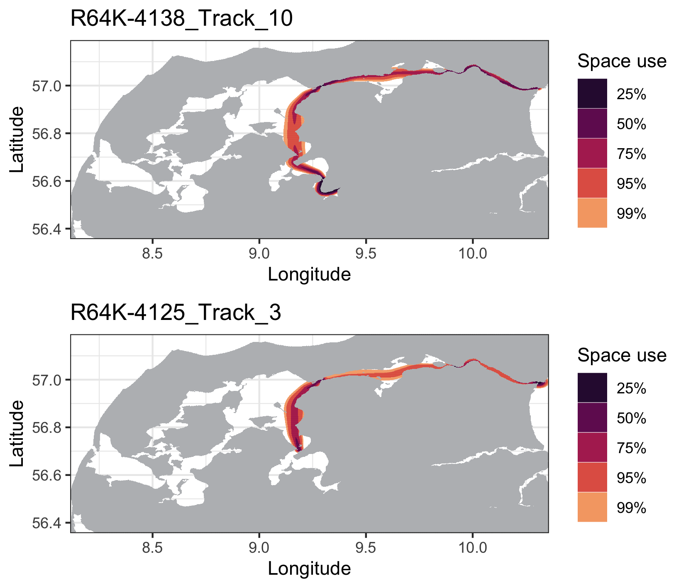
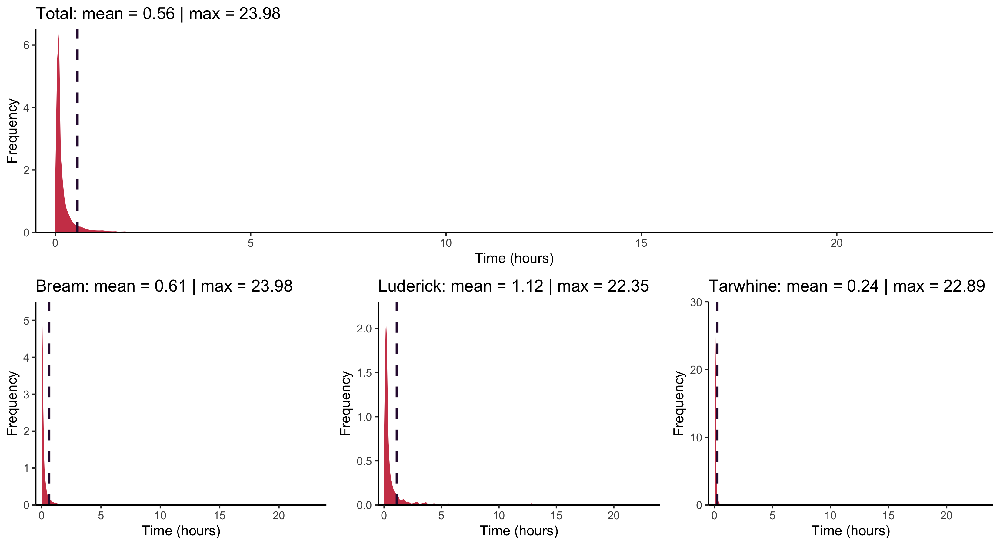
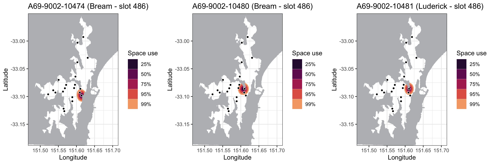
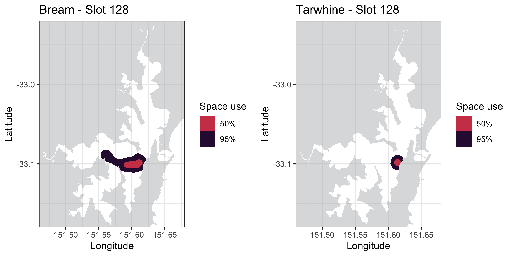

```{r setup, include = FALSE}
knitr::opts_chunk$set(
	echo = TRUE)
```

## Index

1. [Preparing the data](a-1_Preparing_the_data.html)
2. [Refining the Shortest Paths in-water](a-2_Refining_Shortest_paths.html)
3. [Calculating utilization distribution](a-3_dBBMM.html)
4. [Calculating overlaps](a-4_Overlaps.html)

***

After estimating the in-water shortest paths, we can now use the output from `runRSP()` to calculate utilization distribution areas using **dynamic Brownian Bridge Movement Models** (dBBMM) with the `dynBBMM()` function. If you are using a geographic coordinate reference system, here you will need to know the [UTM zone](http://www.dmap.co.uk/utmworld.htm) of your study site and specify it using the argument `UTM`. By default, the analysis will run for all transmitters detected, but you can determine also which transmitters you would like to include using `tags`.

A common error you might get when calculating dBBMMs is that the model does not have enough space to perform its calculations. This can happen when your stations are **near to the edges** of your base raster. When calculating the space use areas, the dBBMM contours might hit these edges causing the algorithm to crash and stop:

```
dbbmm.results <- dynBBMM(input = rsp.results, base.raster = water.shape)

Error: The brownian bridge model needs a larger raster to work on. This could happen because some of the detections are too close to the raster's edge. 
You can create a larger raster by using the argument 'buffer' in loadShape. If the error persists, increase the buffer size further.
```

This can be fixed simply by increasing the size of your base raster using the argument `buffer` in the function `loadShape()`. The buffer argument can take one value (which is applied to all directions), or four values (xmin, xmax, ymin, ymax). Remember to provide a buffer in metres for metric shapefiles, and in degrees for geographic shapefiles:

```
water.large <- loadShape(shape = "my_study_areas.shp", size = 0.0001, buffer = 0.05)  
```

## 3.1. Total dynamic Brownian Bridge Movement Model (group dBBMM)

This option calculates a series of dBBMM for each animal track from all the groups monitored and included in the `runRSP()` analysis. Track **quality checks** are performed to ensure that only good tracks are used, which will allow the dBBMM to converge properly. This is an example of the returned messages from `dynBBMM()`:

```
dbbmm.results <- dynBBMM(input = rsp.results, UTM = 32, base.raster = water.large)

M: Converting coordinates to UTM. Original latitude/longitude values for the detections will be stored in columns 'O.LAT' and 'O.LON'.
M: Preparing data to apply dBBMM.
M: No specific transmitters selected. All the data will be used for analysis.
Warning: 7 track(s) in group R64K-4075 have less than eight detections and will not be used.
Warning: 1 track(s) in group R64K-4075 are shorter than 30 minutes and will not be used.
Warning: 2 individual detections were removed in group R64K-4125 due to simultaneous detections at two receivers.
Warning: 1 track(s) in group R64K-4125 have less than eight detections and will not be used.
Warning: 1 track(s) in group R64K-4128 have less than eight detections and will not be used.
Warning: 2 track(s) in group R64K-4128 are shorter than 30 minutes and will not be used.
Warning: 6 track(s) in group R64K-4138 have less than eight detections and will not be used.
M: In total, 93 detections were excluded as they failed the track quality checks.
```

Note:
  : You can suppress the individual warning messages by setting `verbose` to FALSE. You will still receive one single message indicating how many detections were excluded in total. After calculating UDs, the **land areas** are excluded so that the final results represent only **in-water areas of use**.

```
dbbmm_all <- dynBBMM(input = rsp.data, UTM = 32, base.raster = water.large, verbose = FALSE)

M: Converting coordinates to UTM. Original latitude/longitude values for the detections will be stored in columns 'O.LAT' and 'O.LON'.
M: Preparing data to apply dBBMM.
M: No specific transmitters selected. All the data will be used for analysis.
M: In total, 93 detections were excluded as they failed the track quality checks.
M: Calculating dBBMM: R64K-4075
M: Success! (Time spent: 00:00:06)
M: Calculating dBBMM: R64K-4125
M: Success! (Time spent: 00:01:07)
M: Calculating dBBMM: R64K-4128
M: Success! (Time spent: 00:00:10)
M: Calculating dBBMM: R64K-4138
M: Success! (Time spent: 00:00:43)
M: Subtracting land areas from output.
```

The metadata on the tracks used for the dBBMMs is saved in the `$valid.tracks` object as a data frame:

| Group|       Tag|   Track|valid.n|         First.time|          Last.time|   Timespan|
|:-----|---------:|-------:|------:|------------------:|------------------:|----------:|
|     A| R64K-4075|Track_03|    125|2018-03-07 00:41:10|2018-03-07 08:20:02| 7.64 hours|
|     A| R64K-4075|Track_08|     27|2018-04-23 05:10:47|2018-04-23 08:43:45| 3.54 hours|
|     A| R64K-4075|Track_09|    303|2018-04-24 11:40:56|2018-04-26 01:00:13|37.32 hours|
|     B| R64K-4125|Track_02|    206|2018-04-21 13:13:24|2018-04-23 09:09:34|43.93 hours|
|     B| R64K-4125|Track_03|   1118|2018-04-25 11:44:05|2018-04-28 14:10:14|74.43 hours|

Included is information on the biological group (Group) tracked, number of valid detections (valid.n) used, and the duration of each model (Timespan) in hours.  

You can use `plotContours()` to visualize any of the dBBMM calculated by specifying the `tag` and `track` you want to plot:

```
plotContours(input = dbbmm_all, tag = "R64K-4138", track = 10)
plotContours(input = dbbmm_all, tag = "R64K-4125", track = 3)
```

Note:
  : If a given tag only has one track, specifying just the tag will suffice.

<center>

{#id .class width=70% height=70%} 

</center>

The `breaks` argument can be used to specify which contours to plot. By default, the **25%**, **50%**, **75%**, and **95%** contours are returned. Again, `addStations()` can be used to add the station locations.

## 3.2. Fine-scale dynamic Brownian Bridge Movement Model (timeslot dBBMM)

dBBMMs can also be calculated according to a **fixed moving temporal window**. This allows investigating how space use patterns varied in fine-scale. It is useful for assessing the influence of environmental parameters upon space-use of different groups tracked within the study area. The same `dynBBMM()` function is used, but here the argument `timeframe` has to be defined **in hours** as the temporal window of interest. The total tracking period will be divided into `timeslots`, and dBBMMs calculated for each group monitored (for each timeslot).

Note:
  : You can use the `plotDensities()` function to help you choose the most suitable `timeframe` for `dynBBMM()`, to make sure you won't be mostly using exclusively interpolated locations in your fine-scale analysis:

```
plotDensities(rsp.data) # All groups are simultaneously analysed by default!
plotDensities(rsp.data, group = "Bream")
plotDensities(rsp.data, group = "Luderick")
plotDensities(rsp.data, group = "Tarwhine")
```

{#id .class width=95%} 

On this plot, we can notice that most of the consecutive detections occurred at intervals of less than one or two hours for all groups combined (Total), and that **Luderick** was the group with longest mean detection intervals.

<br/>

Now that we verified that most of the acoustic detections occurred according below two hour time intervals (when the default `max.time` of 24 hours was used in `runRSP()`), setting up a **timeframe** argument longer than this value should be safe for analysis. Let's perform a fine-scale analysis using a daily resolution (i.e. `timeframe = 24`):

```
dbbmm.time <- dynBBMM(input = rsp.data, UTM = 56, base.raster = water.shape, timeframe = 24, verbose = FALSE, start.time = "2014-07-01 00:00:00", stop.time = "2015-01-01 00:00:00")

M: Converting coordinates to UTM. Original latitude/longitude values for the detections will be stored in columns 'O.LAT' and 'O.LON'.
M: Discarding detection data previous to 2014-07-01 00:00:00 and posterior to 2015-01-01 00:00:00 per user command.
M: Preparing data to apply dBBMM.
M: No specific transmitters selected. All the data will be used for analysis.
M: Activating separate dBBMM calculations for each time slot.
M: In total, 60 detections were excluded as they failed the track quality checks.
M: Calculating dBBMM: Bream
  |============================================================| 100%
M: Success! (Time spent: 00:15:29)
M: Calculating dBBMM: Tarwhine
  |============================================================| 100%
M: Success! (Time spent: 00:03:07)
M: Subtracting land areas from output.
```

Please note that you can run the analysis for only a time interval of interest using the `start.time` and `stop.time` arguments. Setting a **start.time** will cause all data previous to this time to be excluded and, similarly, setting a **stop.time** will exclude all the data posterior to the specified time (you can choose to use only one of these two arguments).

Metadata on the timeslots generated for the analysis is returned in the `$timeslots` object:

| slot|               start|                stop| 
|:----|-------------------:|-------------------:|
|    1| 2014-06-30 00:00:00| 2014-06-30 23:59:59|
|    2| 2014-07-01 00:00:00| 2014-07-01 23:59:59|
|    3| 2014-07-02 00:00:00| 2014-07-02 23:59:59|
|    4| 2014-07-03 00:00:00| 2014-07-03 23:59:59|
|    5| 2014-07-04 00:00:00| 2014-07-04 23:59:59|
|    6| 2014-07-05 00:00:00| 2014-07-05 23:59:59|

And a new column will be included in the `$valid.tracks` object, displaying the corresponding timeslot (Slot) that the dBBMMs were calculated for. Notice how the valid tracks were partitioned to fit in the defined `timeframe` (24 hours).

|   Group|           Tag|  Track|Slot |valid.n|         First.time|          Last.time|  Timespan|
|:-------|-------------:|------:|----:|------:|------------------:|------------------:|---------:|
|   Bream|A69-9002-10473|Track_7|    1|    103|2014-07-01 00:05:53|2014-07-01 12:54:03|12.8 hours|
|   Bream|A69-9002-10473|Track_7|    2|    121|2014-07-01 13:03:58|2014-07-02 06:02:47|16.9 hours|
|   Bream|A69-9002-10473|Track_8|   13|    105|2014-07-12 18:40:30|2014-07-13 12:55:45|18.2 hours|
|Tarwhine|  A69-9004-489|Track_3|  128|    280|2014-11-04 14:01:15|2014-11-05 13:53:22|23.8 hours|
|Tarwhine|  A69-9004-489|Track_3|  129|    243|2014-11-05 14:00:37|2014-11-06 13:56:15|23.9 hours|
|Tarwhine|  A69-9004-489|Track_3|  130|     98|2014-11-06 14:06:09|2014-11-07 13:52:10|23.7 hours|

You can again use `plotContours()` to visualize the results of the timeslot dBBMM, by setting the **timeslot** of interest:

```
plotContours(input = dbbmm.time, tag = "A69-9004-485", track = "4", timeslot = 124, title = "Bream - Slot 124")
plotContours(input = dbbmm.time, tag = "A69-9004-489", track = "3", timeslot = 124, title = "Tarwhine - Slot 124")
```
{#id .class width=100%} 

Note:
  : You can customize the title of you plot by setting a `title` argument.

## 3.3. Calculating areas of space use

Now that you have dBBMMs you can calculate the areas used with the `getAreas()` function, both at **group** or **track** level, by using the `type` argument. Group areas will correspond to the total areas used by all animals from a particular group. When `type = 'track'`, areas are calculated for each animal track individually. Areas are stored in the `$areas` object, as a list of dataframes for each tracked group.

### 3.3.1. Group areas

```
areas.group <- getAreas(input = dbbmm.time, type = "group")
areas.group$areas$Bream
```

| Slot|    Area.5|  Area.95|
|:----|---------:|--------:|
|    1|	 974333.6|  4310814|
|    2|	1218435.9|	6141996|
|   13|	3037994.5| 12030757|
|   14|	 974333.6|	4408787|
|   15|	 711134.8|	3224808|
|   16|	 696189.8|	3053355|

If your analysis is of type timeslot dBBMM, a column will be added representing the corresponding timeslots (Slot). Please note that the areas of use are calculated by default for the 50% and 95% contours, but can be customized using the `breaks` argument. 

You can plot the group areas of space use using the `plotAreas()` function:
```
plotAreas(areas.group, base.raster = water.shape, group = "Bream", timeslot = 128)
plotAreas(areas.group, base.raster = water.shape, group = "Tarwhine", timeslot = 128) 
```
{#id .class width=100%} 

Note:
  : plotAreas() can only plot group areas (i.e. run with `type = group`).


### 3.3.2. Track areas

```
areas.track <- getAreas(input = dbbmm.time, type = "track")
areas.track$areas$Bream
```

| Slot|                    ID|   Area.5| Area.95|
|:----|---------------------:|--------:|-------:|
|  130| A69.9004.494_Track_01| 719437.6| 2689692|
|  130| A69.9004.496_Track_01| 974748.7| 3658629|
|  130| A69.9004.497_Track_01| 691623.2| 2575944|
|  131| A69.9004.494_Track_01| 712795.4| 2760266|
|  131| A69.9004.496_Track_01| 892135.9| 3463098|
|  131| A69.9004.497_Track_01| 711550.0| 2649008|
|  132| A69.9004.494_Track_01| 679999.3| 2532769|
|  132| A69.9004.496_Track_01| 885908.8| 3410375|
|  132| A69.9004.497_Track_02| 871794.0| 3403733|

Track areas have an **ID** column, identifying the corresponding transmitter and track.


[Proceed to Calculating overlaps](a-4_Overlaps.html)

[Back to top.](#)

