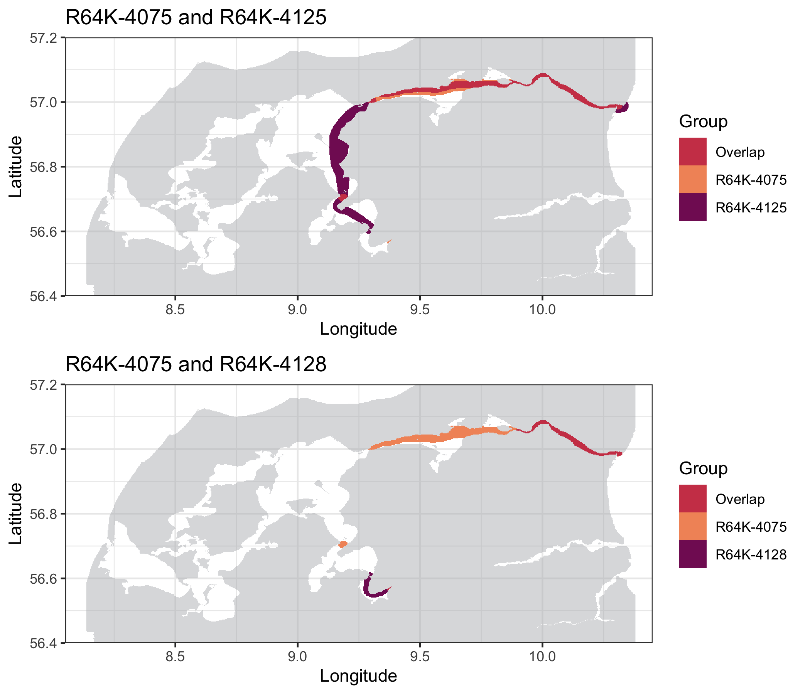

```{r setup, include = FALSE}
knitr::opts_chunk$set(
	echo = TRUE)
```

## Index

1. [Preparing the data](a-1_Preparing_the_data.html)
2. [Refining the Shortest Paths in-water](a-2_Refining_Shortest_paths.html)
3. [Calculating utilization distribution](a-3_dBBMM.html)
4. [Calculating overlaps](a-4_Overlaps.html)

***

If your study comprises **multiple biological groups** (e.g. different species, different sexes, etc.), you might find it useful to calculate the **overlap** between them. To calculate the overlaps, the areas of space use must be first calculated at **group** level (using the `getAreas()` function with `type = 'group'`). Overlaps are automatically calculated at the same levels provided in the `breaks` argument in `getAreas()` (50% and 95% by default). Areas of overlap correspond to the area/percentage of the smallest area that falls within the largest area, calculated for all monitored groups and returned both in absolute (squared metres) and percentages. 

### 4.1. Calculating overlaps for group dBBMM 

When utilization distribution areas are calculated for **group dBBMM**, models are calculated at the track level for each monitored animal. This analysis does not provide standardized tracks, and start and end times vary among tracked individuals depending on when they were present within the study area. Consequently, this option will simply calculate the general overlapping areas among the groups of interest:

```
overlap.save <- geOverlaps(areas.group)
overlap.save$areas$`0.95`$absolute
```

|          | R64K-4075 | R64K-4125| R64K-4128| R64K-4138|
|:---------|----------:|---------:|---------:|---------:|
| R64K-4075|         NA|  82080502|  31831020| 103273976|
| R64K-4125|   82080502|        NA|  33164114| 186469924|
| R64K-4128|   31831020|  33164114|        NA|  44753870|
| R64K-4138|  103273976| 186469924|  44753870|        NA|


```
overlap.save$areas$`0.95`$percentage
```

|          | R64K-4075 | R64K-4125| R64K-4128| R64K-4138|
|:---------|----------:|---------:|---------:|---------:|
| R64K-4075|         NA| 0.7607161| 0.7090909| 0.9571357|
| R64K-4125|  0.7607161|        NA| 0.7387879| 0.9081876|
| R64K-4128|  0.7090909| 0.7387879|        NA| 0.9969697|
| R64K-4138|  0.9571357| 0.9081876| 0.9969697|        NA|

In the example we can notice that **R64K-4075** and **R64K-4125** used 76.07% of the same areas, whereas **R64K-4075** and **R64K-4128** only overlapped in 70.91%. Now we can use `plotOverlaps()` to see exactly where in the study area these overlaps took place:

```
plotOverlaps(overlaps = over.save, areas = areas.save, base.raster = water.shape, 
	groups = c("R64K-4075", "R64K-4125"), level = 0.95) 
plotOverlaps(overlaps = over.save, areas = areas.save, base.raster = water.shape, 
	groups = c("R64K-4075", "R64K-4128"), level = 0.95)

Warning message:
Raster pixels are placed at uneven horizontal intervals and will be shifted. Consider using geom_tile() instead.
```

<center>

{#id .class width=80%} 

</center>

Please note that these plots can return a **warning**. This is issued by **ggplot2** because, when there are multiple tracks/tags in the same group, the empty cells of the raster are cleared out to improve plotting efficiency. Please be aware that **this warning is harmless** for the map created.

### 4.2. Calculating overlaps for timeslot dBBMM 

The standardized tracks returned from **timeslot dBBMM** can be used to calculate overlaps between multiple groups both in **space** and **time**. 

```
overlap.save <- geOverlaps(areas.group)
overlap.save$areas$`0.95`$absolutes$`128`
```
|         |      Bream|  Tarwhine|
|:--------|----------:|---------:|
|   Bream |         NA|   2454723|
| Tarwhine|    2454723|        NA|

```
overlap.save$areas$`0.95`$percentage$`128`
```

|         |      Bream|  Tarwhine|
|:--------|----------:|---------:|
|   Bream |         NA| 0.9680747|
| Tarwhine|  0.9680747|        NA|


```
plotOverlaps(overlaps = overlap.save, areas = areas.group, base.raster = water.shape, 
  groups = c("Bream", "Tarwhine"), timeslot = 127, level = 0.95, title = "timeslot 127") 


plotOverlaps(overlaps = overlap.save, areas = areas.group, base.raster = water.shape, 
  groups = c("Bream", "Tarwhine"), timeslot = 128, level = 0.95, title = "timeslot 128") 
```

{#id .class width=95%} 


Note that if the two groups don't overlap, the following message will be issued:

```
M: No overlap found between 'Bream' and 'Tarwhine'. Plotting only the separate areas.
```


## The end

You have reached the end of the manual! We wish you the best luck with your data :)

If you find any bug, please let us know [through this link.](https://github.com/YuriNiella/RSP/issues)

[Back to top.](#)
