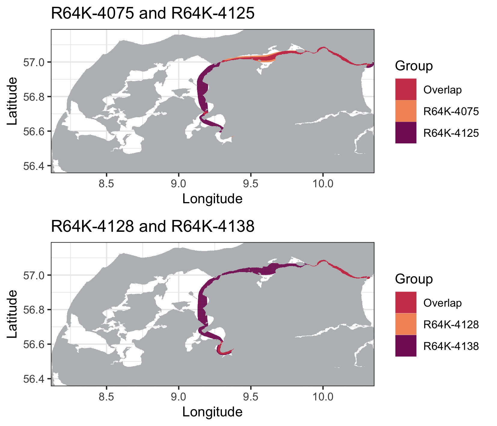

```{r setup, include = FALSE}
knitr::opts_chunk$set(
	echo = TRUE)
```

## Index

1. [Preparing your data](a-1_Preparing_the_data.html)
2. [Estimation of Refined Shortest Paths in-water](a-2_Estimating_in-water_paths.html)
3. [Calculating utilization distribution areas](a-3_dBBMM_overlaps.html)


### 4. Total space-use overlap 

Now that we calculated the areas of space-use within our study area for each group monitored, we can investigate the amount of overall overlap between them by inspecting the `$overlap.areas` object:

```
dbbmm.results$overlap.areas$`0.5`$absolute
```
|          | R64K-4075| R64K-4125| R64K-4128| R64K-4138|
|:---------|---------:|---------:|---------:|---------:|
| R64K-4075|        NA|      1716|      1792|      3606|
| R64K-4125|   	  1716|        NA|      1769|      3551|
| R64K-4128|	    1792|      1769|        NA|      2635|
| R64K-4138|      3606|      3551|      2635|        NA|

```
dbbmm.results$overlap.areas$`0.5`$percentage
```
|          | R64K-4075| R64K-4125| R64K-4128| R64K-4138|
|:---------|---------:|---------:|---------:|---------:|
| R64K-4075|        NA| 0.3622546| 0.6775047| 0.6049321|
| R64K-4125| 0.3622546|        NA| 0.6688091| 0.7496306|
| R64K-4128| 0.6775047| 0.6688091|        NA| 0.9962193|
| R64K-4138| 0.6049321| 0.7496306| 0.9962193|        NA|

```
dbbmm.results$overlap.areas$`0.95`$absolute
```
|          | R64K-4075| R64K-4125| R64K-4128| R64K-4138|
|:---------|---------:|---------:|---------:|---------:|
| R64K-4075|  	    NA|     12851|      4893|     17480|
| R64K-4125|     12851|        NA|      5115|     29210|
| R64K-4128|	  4893|      5115|        NA|      6839|
| R64K-4138|     17480|     29210|      6839|        NA|

```
dbbmm.results$overlap.areas$`0.95`$percentage
```
|          | R64K-4075| R64K-4125| R64K-4128| R64K-4138|
|:---------|---------:|---------:|---------:|---------:|
| R64K-4075|        NA| 0.7247349| 0.7133693| 0.9857884|
| R64K-4125| 0.7247349|        NA| 0.7457355| 0.9064672|
| R64K-4128| 0.7133693| 0.7457355|        NA| 0.9970841|
| R64K-4138| 0.9857884| 0.9064672| 0.9970841|        NA|

Please note the overlaps are calculated for the contours defined by `breaks` in `dynBBMM()`, and returned both in **absolute values** (squared metres) and **percentage** matrices. For example, we can see in the last table that **R64K-4128** and **R64K-4138** were the groups with higher overall overlap of 99.71% at the 95% level, whereas **R64K-4075** and **R64K-4128** had a smaller overlap of 71.34% at the 95% contour. To see exactly where space use overlaps occurred you can use `plotOverlap()`:

```
plotOverlap(input = dbbmm.results, stations = FALSE, level = .95, store = TRUE)
```
<center>
{#id .class width=70% height=70%} 
</center>

